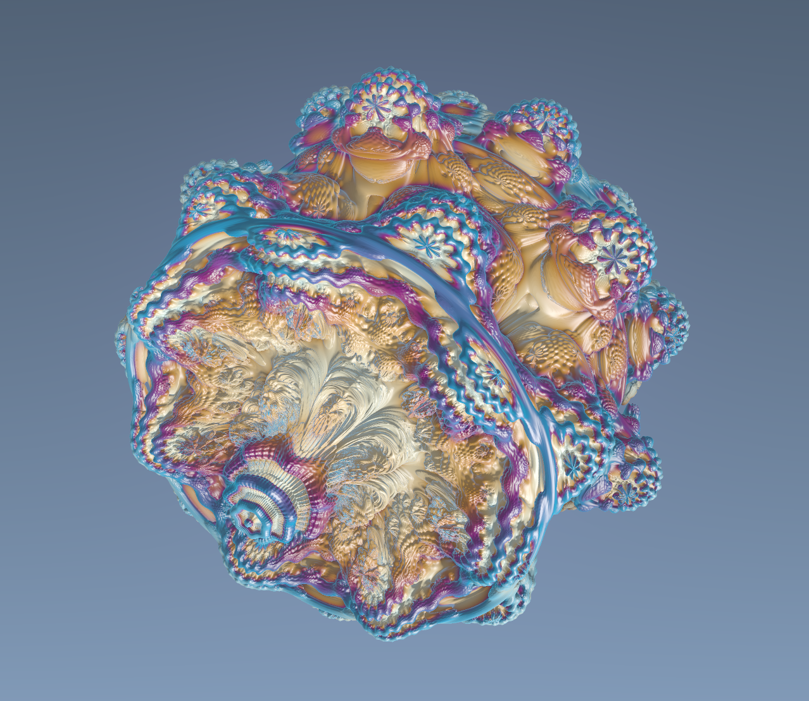

# fractal3D

A simple real-time ray-marched Mandelbulb fractal renderer using Rust and gpu fragment shaders.

## Requirements

- Rust toolchain (stable)
- A GPU and drivers supported by wgpu

## Build and run

1. Install rustup (https://rustup.rs/), then: `rustup install stable`
2. Build and run (development): `cargo run`
3. Build and run (optimized, recommended): `cargo run --release`

## Notable files
- `src/main.rs` — shader setup/bootstrap code
- `assets/shaders/mandelbulb.wgsl` — shader fragment code
- `example/` — example outputs

## Example Output

